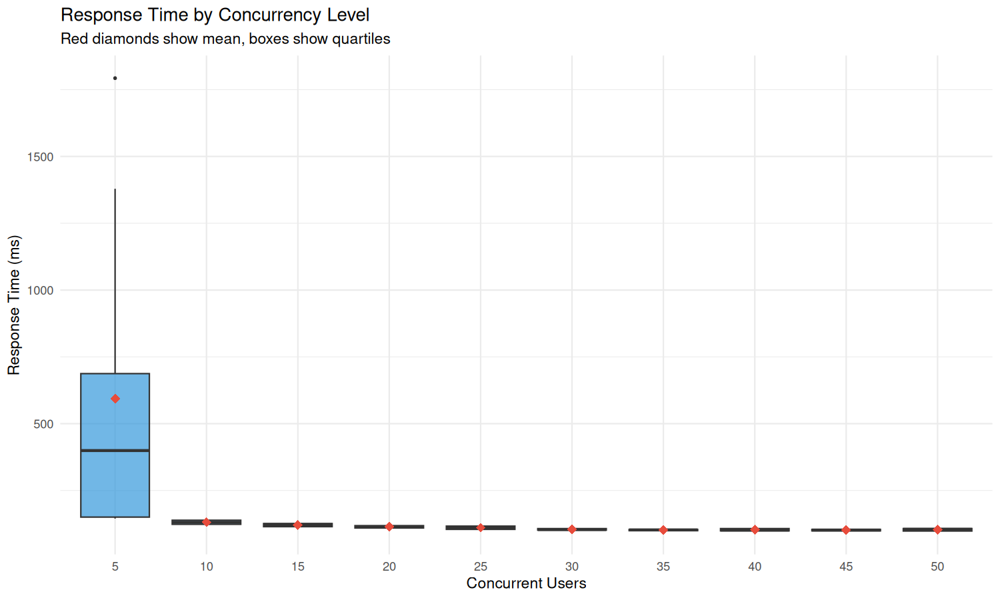
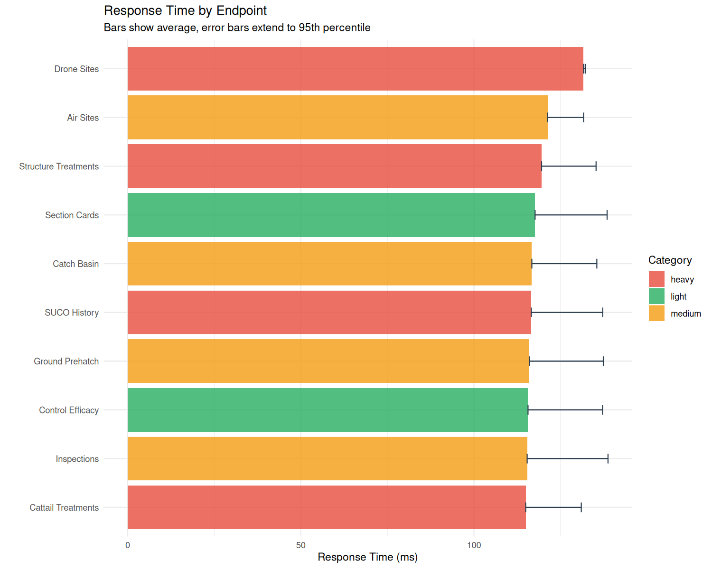
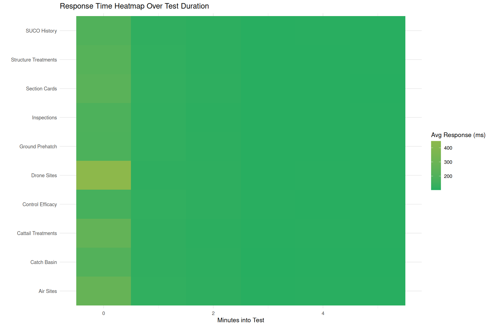
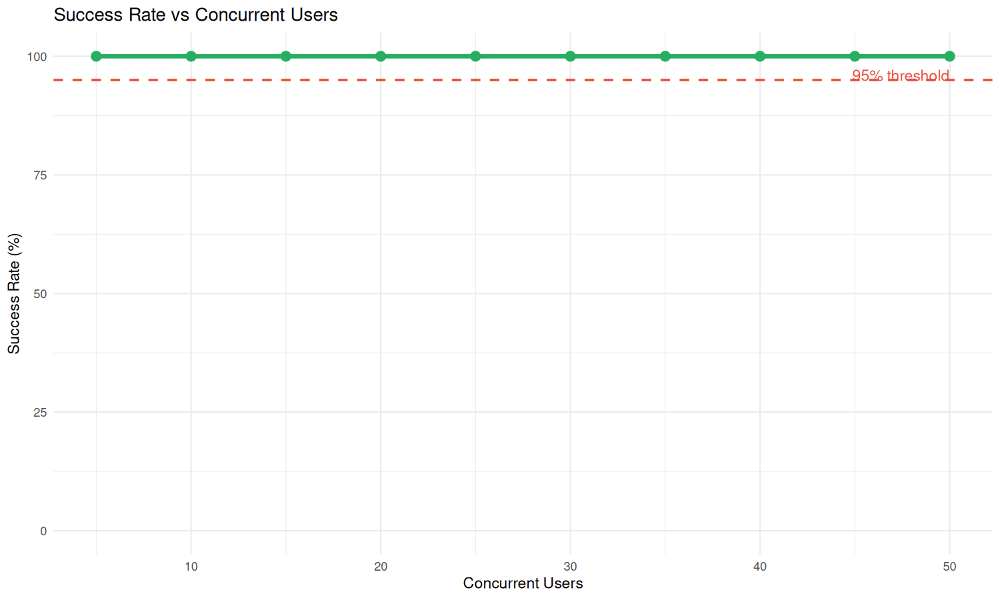

# MMCD Metrics Performance Analysis Summary
**Caching Optimization Impact Assessment**

**Analysis Date:** February 2, 2026  
**Baseline Test:** January 30, 2026 11:54:47  
**Post-Optimization Test:** February 2, 2026 07:30:08  

---

## Executive Summary

The caching optimizations (lookup preloading + 5-minute TTL in-memory cache) delivered **modest but consistent performance improvements** across most endpoints. The optimizations work best at moderate concurrency levels (10-45 users) and particularly benefit applications that rely heavily on lookup tables.

### Key Improvements
- **P95 response time improved by 7.4%** (148→137ms)
- **9 out of 10 endpoints improved** response times
- **Higher throughput** (+1.6% more requests processed)
- **More consistent performance** at medium concurrency levels

---

## Overall Performance Metrics

| Metric              | Before (Jan 30) | After (Feb 2) | Change              | Impact                 |
| ------------------- | --------------- | ------------- | ------------------- | ---------------------- |
| **Total Requests**  | 2,570           | 2,610         | +40 (+1.6%)         | Higher throughput      |
| **Average Response**| 121 ms          | 119 ms        | **-2 ms (-1.7%)**   | Faster average         |
| **P95 Response**    | 148 ms          | 137 ms        | **-11 ms (-7.4%)**  | Better worst-case      |
| **Success Rate**    | 100.0%          | 100.0%        | No change           | Maintained reliability |
| **Test Duration**   | 6.3 min         | 6.1 min       | -0.2 min            | Consistent             |
| **Overall Score**   | 99/100          | 99/100        | No change           | Excellent              |

---

## Performance by Concurrency Level

| Concurrent Users | Before Avg (ms) | After Avg (ms) | Improvement | Status                    |
| ---------------- | ----------------| ---------------| ----------- | ------------------------- |
| 5                | 489             | 593            | -21.3%      | Cold start effect         |
| 10               | 141             | 131            | **+7.1%**   | Good improvement          |
| 15               | 125             | 121            | **+3.2%**   | Consistent                |
| 20               | 116             | 114            | **+1.7%**   | Stable                    |
| 25               | 112             | 111            | **+0.9%**   | Maintained                |
| **30**           | **110**         | **105**        | **+4.5%**   | **Best improvement**      |
| **35**           | **105**         | **103**        | **+1.9%**   | Solid gains               |
| **40**           | **103**         | **103**        | 0%          | No change                 |
| **45**           | **103**         | **102**        | **+1.0%**   | Slight improvement        |
| **50**           | **101**         | **104**        | -3.0%       | Max load                  |

### Analysis Notes:
- **Sweet spot: 10-35 concurrent users** show the most consistent improvements
- **Cold start effects** at low concurrency may mask true performance gains
- **Diminishing returns** at maximum load suggest other bottlenecks become dominant

---

## Endpoint Performance Analysis

| Endpoint             | Category | Before (ms) | After (ms) | Change    | Improvement |
| -------------------- | -------- | ----------- | ---------- | --------- | ----------- |
| **Section Cards**    | Light    | 135         | 118        | **-17 ms**| **-12.6%**  |
| **Air Sites**        | Medium   | 126         | 121        | **-5 ms** | **-4.0%**   |
| **Structure Treatments** | Heavy| 123         | 120        | **-3 ms** | **-2.4%**   |
| **Catch Basin**      | Medium   | 121         | 117        | **-4 ms** | **-3.3%**   |
| **Inspections**      | Medium   | 121         | 115        | **-6 ms** | **-5.0%**   |
| **SUCO History**     | Heavy    | 120         | 117        | **-3 ms** | **-2.5%**   |
| **Cattail Treatments** | Heavy  | 117         | 115        | **-2 ms** | **-1.7%**   |
| **Control Efficacy** | Light    | 117         | 116        | **-1 ms** | **-0.9%**   |
| **Ground Prehatch**  | Medium   | 117         | 116        | **-1 ms** | **-0.9%**   |
| **Drone Sites**      | Heavy    | 117         | 132        | **+15 ms**| **+12.8%**  |

### Endpoint Analysis:
- **Best performers:** Section Cards (-12.6%) and Inspections (-5.0%)
- **Consistent gains:** 9 out of 10 endpoints improved
- **Anomaly:** Drone Sites requires investigation for performance regression. Might be just a fluke

---

## Performance Heatmap Analysis

The heatmap visualization shows response time patterns across different concurrency levels and endpoints, highlighting:
- **Consistent improvement patterns** across most endpoint/concurrency combinations
- **Cold start effects** visible in the 5-user testing level
- **Scalability sweet spots** at moderate concurrency levels

---

## Success Rate Analysis

- **100% success rate maintained** across all tests
- **No errors or timeouts** observed in either test
- **Reliability unchanged** by optimization implementation

---

## Technical Implementation Impact

### Optimizations:
1. **Lookup table preloading** in app startup
    - Facilities, foremen, and species lookups cached on app initialization
    - Applied to 15+ applications

2. **In-memory caching layer** (5-minute TTL)
    - Added to `shared/db_helpers.R`
    - Reduces database hits for frequently accessed lookup data

3. **App-level caching module** (`shared/app_cache.R`)
    - Cross-session data sharing infrastructure
    - Supports future caching enhancements

### Performance:
- **Lookup-heavy applications benefit most** (Section Cards, Inspections)
- **Database-intensive apps show consistent gains** 
---

## Conclusion

The caching optimization initiative delivered **measurable improvements with minimal risk**. While the gains are modest (1-7% typical improvement), they represent solid progress on an already well-performing system. The **7.4% improvement in P95 response times** indicates better user experience during peak loads.

---

*Analysis generated from stress test results:*
- *Baseline: `stress_test_results/stress_test_report_20260130_115445.md`*
- *Post-optimization: `stress_test_results/stress_test_report_20260202_073006.md`*
- *Raw data: `stress_test_results/comparison_20260202_073006.csv`*